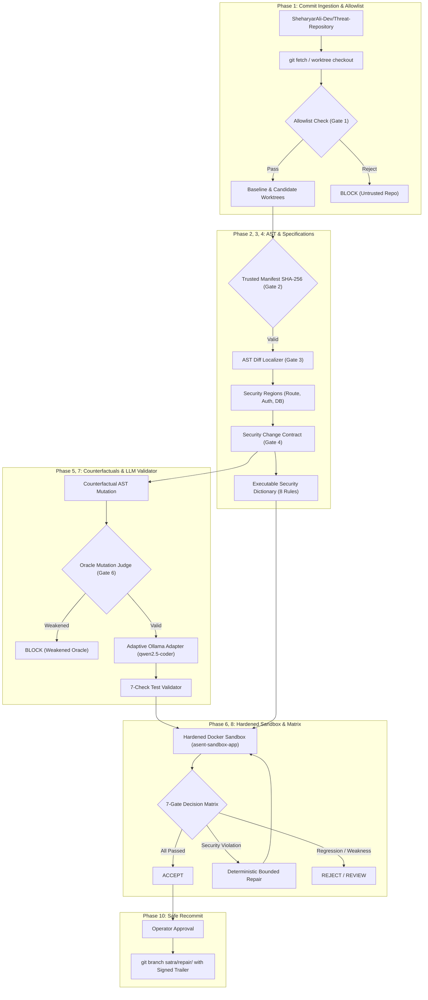

# SATRA-RV Architecture & Verification Flow

```mermaid
flowchart TD
    subgraph Ingestion ["Phase 1: Commit Ingestion & Allowlist"]
        TR["SheharyarAli-Dev/Threat-Repository"] --> Fetch["git fetch / worktree checkout"]
        Fetch --> Allowlist{"Allowlist Check (Gate 1)"}
        Allowlist -- "Pass" --> Worktrees["Baseline & Candidate Worktrees"]
        Allowlist -- "Reject" --> Block["BLOCK (Untrusted Repo)"]
    end

    subgraph Analysis ["Phase 2, 3, 4: AST & Specifications"]
        Worktrees --> Manifest{"Trusted Manifest SHA-256 (Gate 2)"}
        Manifest -- "Valid" --> AST["AST Diff Localizer (Gate 3)"]
        AST --> Regions["Security Regions (Route, Auth, DB)"]
        Regions --> SCC["Security Change Contract (Gate 4)"]
        SCC --> Dict["Executable Security Dictionary (8 Rules)"]
    end

    subgraph Adversarial ["Phase 5, 7: Counterfactuals & LLM Validator"]
        SCC --> Mutants["Counterfactual AST Mutation"]
        Mutants --> OracleCheck{"Oracle Mutation Judge (Gate 6)"}
        OracleCheck -- "Weakened" --> BlockOracle["BLOCK (Weakened Oracle)"]
        OracleCheck -- "Valid" --> Ollama["Adaptive Ollama Adapter (qwen2.5-coder)"]
        Ollama --> SevenChecks["7-Check Test Validator"]
    end

    subgraph Sandbox ["Phase 6, 8: Hardened Sandbox & Matrix"]
        SevenChecks --> Docker["Hardened Docker Sandbox (asent-sandbox-app)"]
        Dict --> Docker
        Docker --> GateMatrix{"7-Gate Decision Matrix"}
        GateMatrix -- "All Passed" --> Accept["ACCEPT"]
        GateMatrix -- "Security Violation" --> Repair["Deterministic Bounded Repair"]
        Repair --> Docker
        GateMatrix -- "Regression / Weakness" --> Review["REJECT / REVIEW"]
    end

    subgraph Recommit ["Phase 10: Safe Recommit"]
        Accept --> Human["Operator Approval"]
        Human --> SignedBranch["git branch satra/repair/<sha7> with Signed Trailer"]
    end
```
